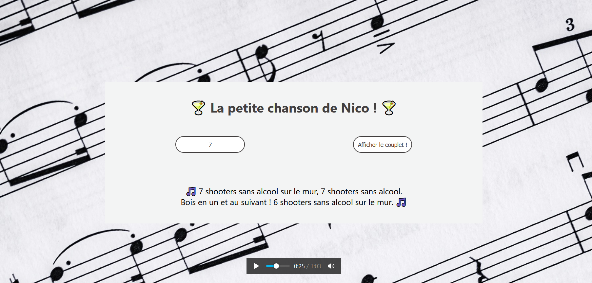

# Sans-alcool la fête est plus folle
## Test pour la licence : La petite chanson de Nico

Ce projet a été réalisé avec la librairie/framework ReactJs.

## Je commence par quoi ?

* Vous pouvez télécharger le dossier Sans-Alcool via mon GitHub (https://github.com/Slemaitre56/Sans-Alcool).
* L'ouvrir avec votre éditeur de code.
* Dans votre terminal, tapez "cd le nom du dossier où vous avez enregistré Sans-Alcool" (si vous n'y êtes pas déjà) puis "npm start". ( Il faut avoir node et npm à jour !)
* Une page va s'ouvrir dans votre navigateur (http://localhost:3000)
* Vous pouvez aller ur https://sans-alcool.herokuapp.com/ pour voir le résultat.

## Je regarde où si je veux vérifier le code ?

Dans votre éditeur de code, il y trois gros dossiers : node_modules / public / src.

* node_modules => On n'y touche pas, c'est un pack de modules qui d'installe lors de la création de l'application ReactJs.

* public => Le plus important est le fichier index.html. On y trouve les balises Meta, Link, Title. Ainsi que la div "root" qui est la racine de l'aplication ReactJs. (Chaque fichiers importés sur le ficher App sera affiché dans "root" => effet onePage).

* src => Là où tout ce passe ! 

### SRC

Allez jeter un oeil ( ne vous faites pas trop mal hein !) dans le ficher App.js qui est utilisé comme Router.

Vous avez un "chemin" (path) Game, qui se trouve dans un autre dossier. Ouvrez-le.

* components > Game > index.js

### Game

Sur cette page se trouve le petit jeux qui anime la chanson de Nico !

Rentrez un nombre de votre choix compris entre 0 et 99 et les paroles de la chanson apparaîtront  !

## Licence/Droits

L'idée ainsi que les paroles de cette application ne m'appartienne pas.

